# 【cfquant】QMT部署教程
- 介绍如何在QMT中部署我们的项目


## 一、【通用模式部署教程】-- 建议先使用这种方式部署

- ### 1、下载项目解压或者通过pip安装后在对应的安装目录中找到我们的安装目录，本次以项目下载解压做为示例，使用国金证券QMT做为示例，其他证券公司QMT一样安装即可。
- ``` 特别提醒：国泰君安和国泰海通的QMT，需要走我们的【极致模式】。```

- ### 2、如图，将我们的项目中cfquant目录复制到你的QMT安装目录，如图所示：
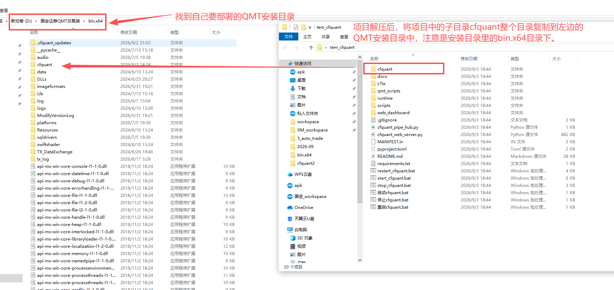

- ### 3、打开我们的QMT，进行登录并且安装好相应的Python环境（已安装可忽略），如图：
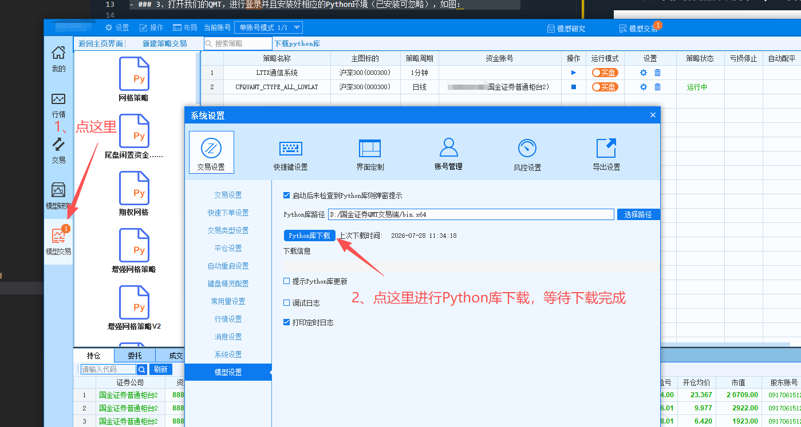

- ### 4、打开大QMT里的模型研究界面--新建策略--新建python策略,如图：
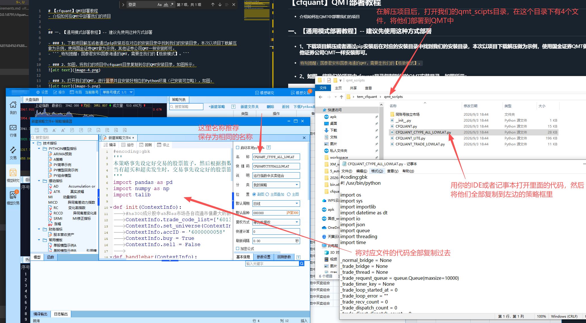

- ### 5、启动我们的策略，如图：
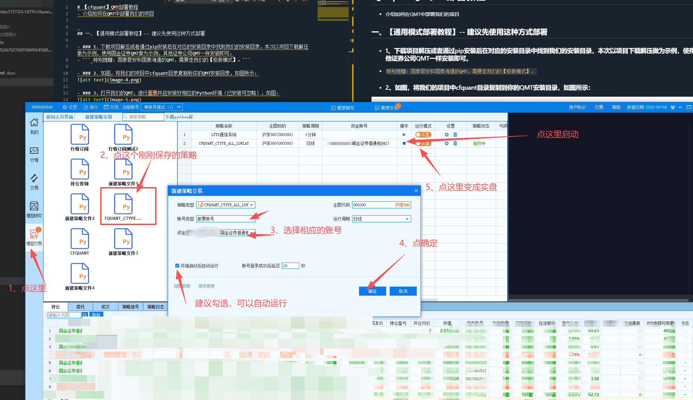

- ### 6、重启我们的QMT，如图：
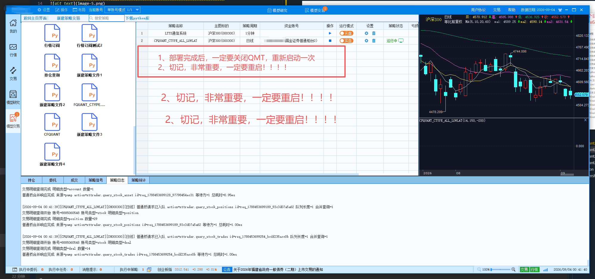


- ### 7、在我们的网页界面中进行账号绑定，如图：
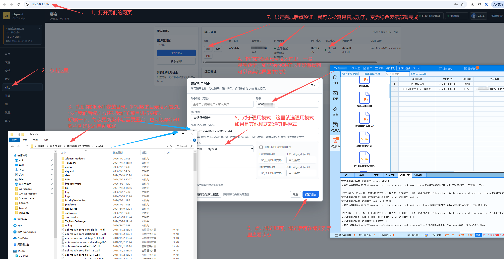

- ### 8、部署成功后的提示
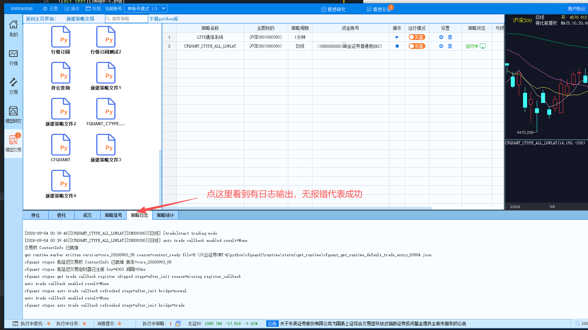

- ### 9、用我们的接口进行调用测试


## 二、【极致模式部署教程】
- ### 1、下载项目解压或者通过pip安装后在对应的安装目录中找到我们的安装目录。
- ``` 特别提醒：国泰君安和国泰海通的QMT，需要走我们的【极致模式】。```

- ### 2、如图，将我们的项目中cfquant目录复制到你的QMT安装目录，如图所示：


- ### 3、打开我们的QMT，进行登录并且安装好相应的Python环境（已安装可忽略），如图：


- ### 4、打开大QMT里的模型研究界面--新建策略--新建python策略,如图：
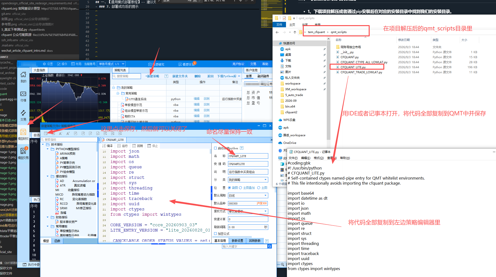

- ### 5、启动我们的策略，如图：
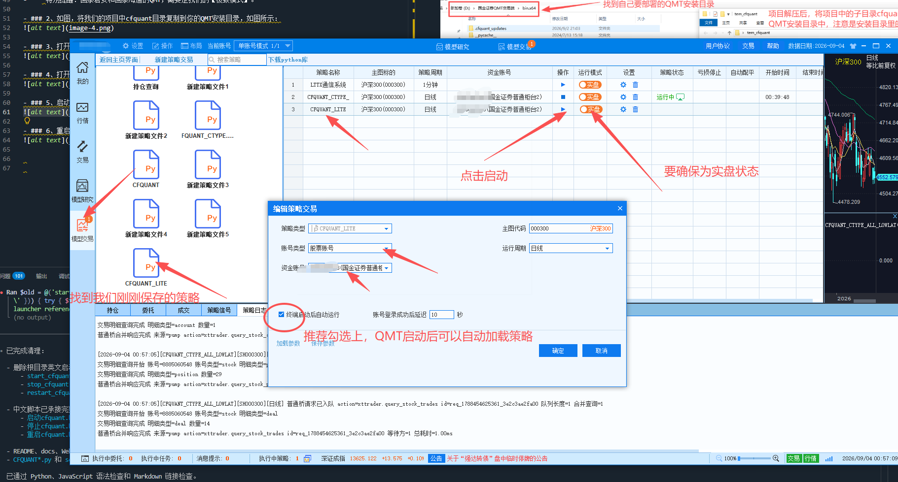

- ### 6、重启我们的QMT，如图：


- ### 7、在我们的网页界面中进行账号绑定，如图：
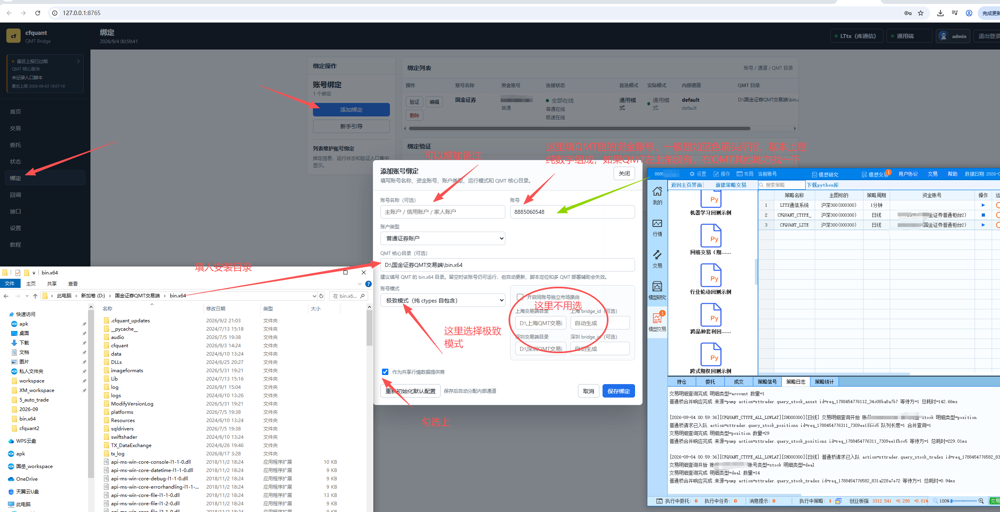

- ### 8、部署成功后可以在网页端的接口中进行调用测试
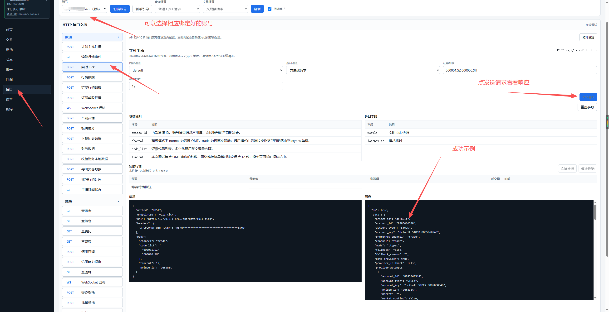


## 三、【高级模式部署教程】
- ``` 特别提醒：高级模式部署比较复杂，但过程其他和上面一致，建议先部署上面后再尝试部署高级模式。```

- ```他们的功能一致，只是高级模式下单延迟要低很多，高级模式下单延迟4ms左右，这里的延迟是指从外部程序到QMT内部，不是指到交易所，至于QMT到交易所的延迟，不在本项目控制范围内，但部署复杂。```

- ```只有一开始的两个QMT不同外，其他部署方式和上方的基本一样```

- ```特别提醒：我们一般将qmt_scripts/CFQUANT_TRADE_LOWLAT.py放到第二个安装的QMT里，第一个QMT里部署我们的qmt_scripts/CFQUANT.py```
- ```国泰海通无法部署高级模式```
- ### 1、我们需要准备两个QMT
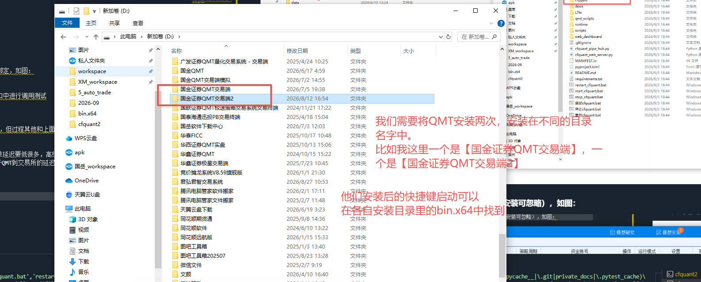

- ### 2、下载项目解压或者通过pip安装后在对应的安装目录中找到我们的安装目录，本次以项目下载解压做为示例，使用国金证券QMT做为示例，其他证券公司QMT一样安装即可。
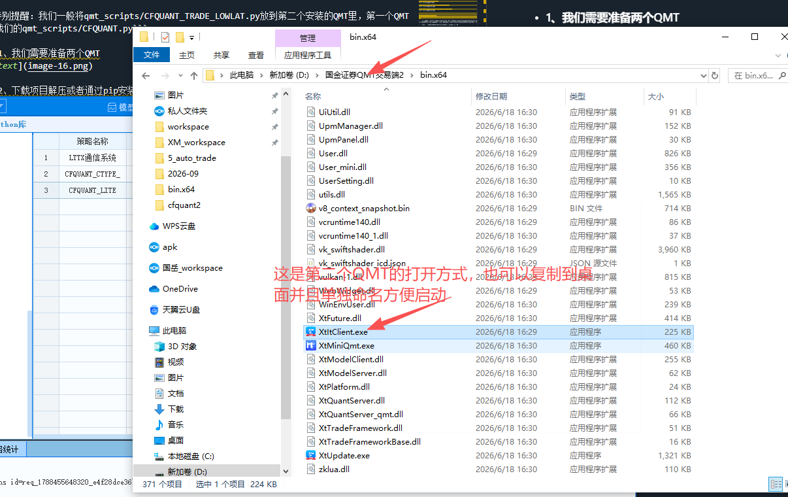


- ### 3、如图，将我们的项目中cfquant目录复制到你的QMT安装目录，如图所示：


- ### 4、打开我们的两个QMT，进行登录并且安装好相应的Python环境（已安装可忽略），如图：


- ### 4、打开大QMT里的模型研究界面--新建策略--新建python策略,如图：
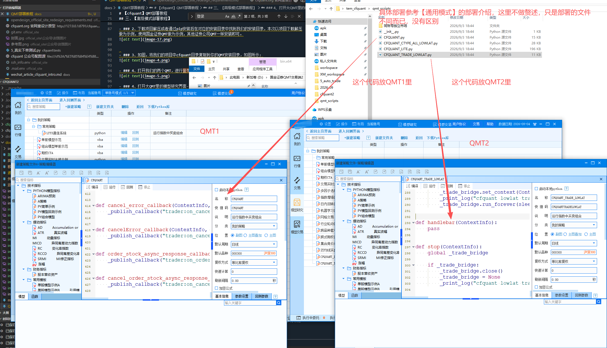

- ### 5、启动我们两个QMT里的策略，如图：


- ### 6、重启我们的QMT，如图：


- ### 7、在我们的网页界面中进行账号绑定，如图：
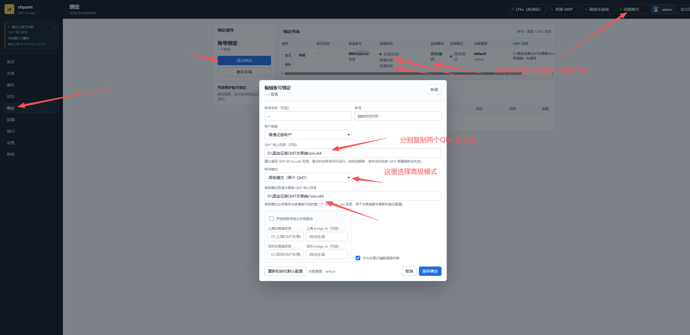

- ### 8、部署成功后的提示

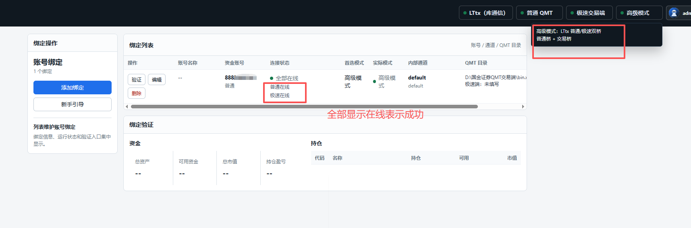

- ### 9、用我们的接口进行调用测试


- ### 10、非开盘时间下的低延迟测试结果
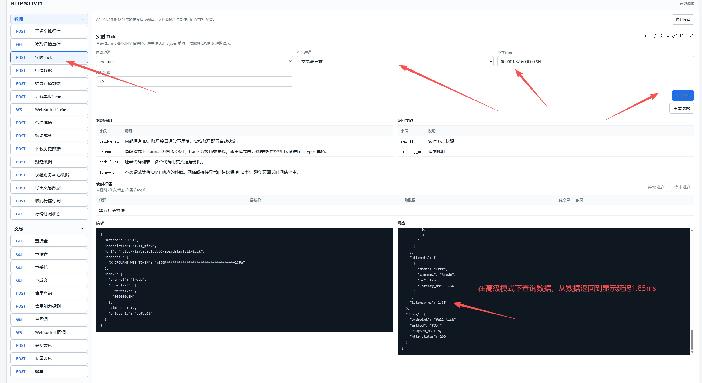


## 四、写在最后
- 部署相对复杂一些，但延迟确实是做得比较低。
- 有不清楚的可以通过我们的首页加入我们的交流群。
- 如有远程帮忙部署指导需求，可以添加我的微信13696119612，服务费100元/次。
- 如有其他二次开发需求，整体系统架构方案，多账号交易矩阵，低延迟链路，敬请联系。


