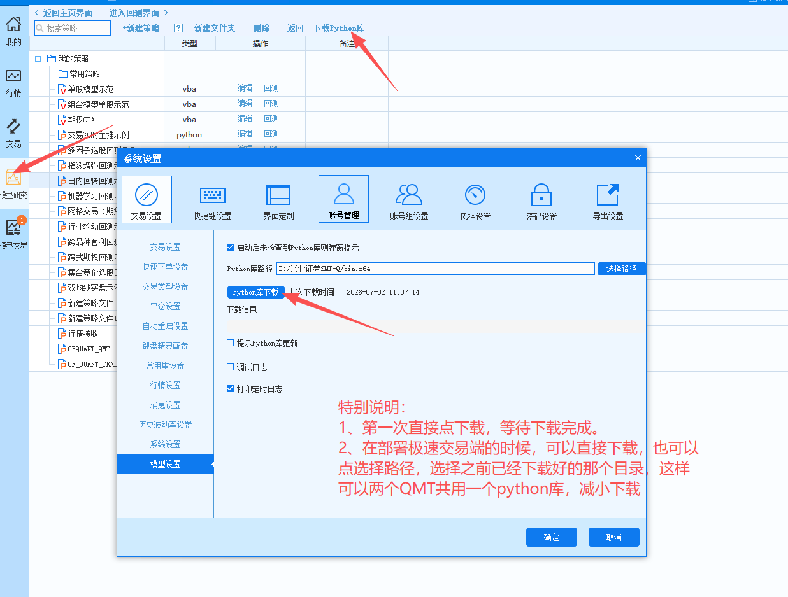
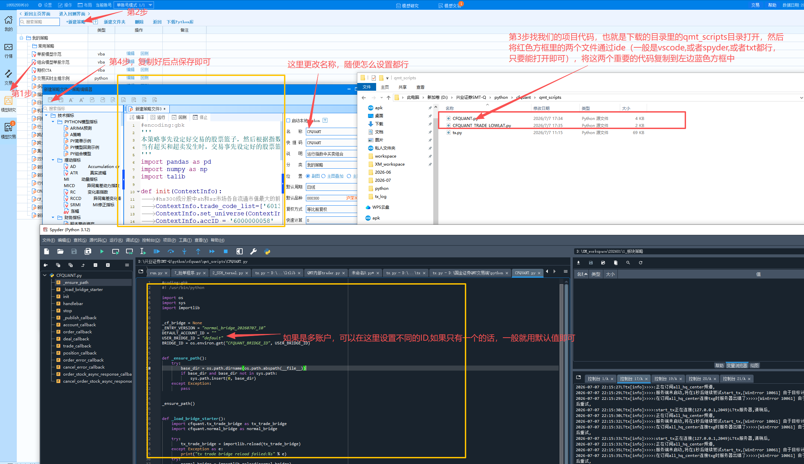
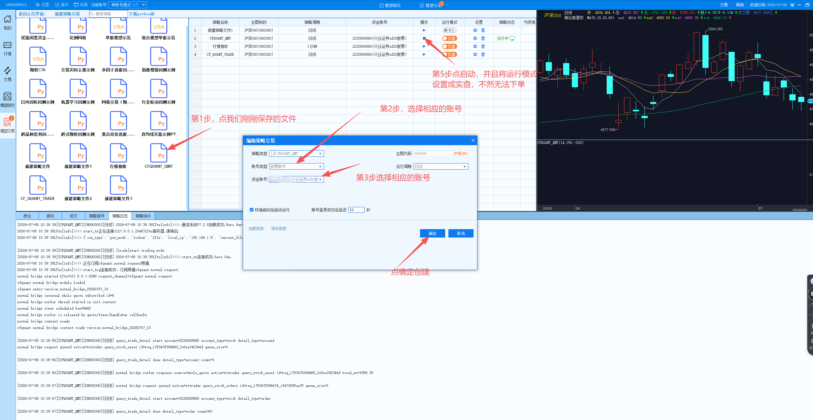
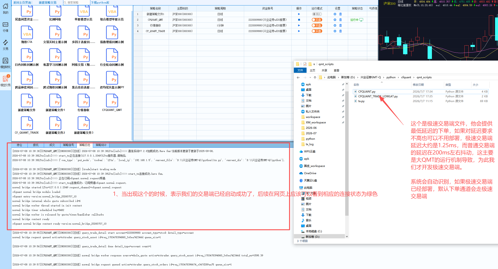
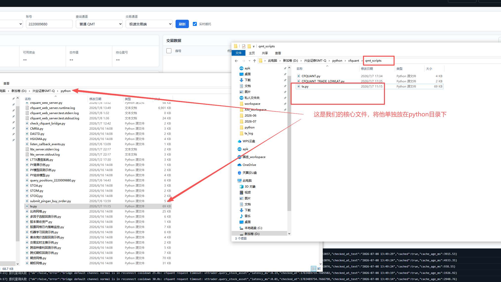
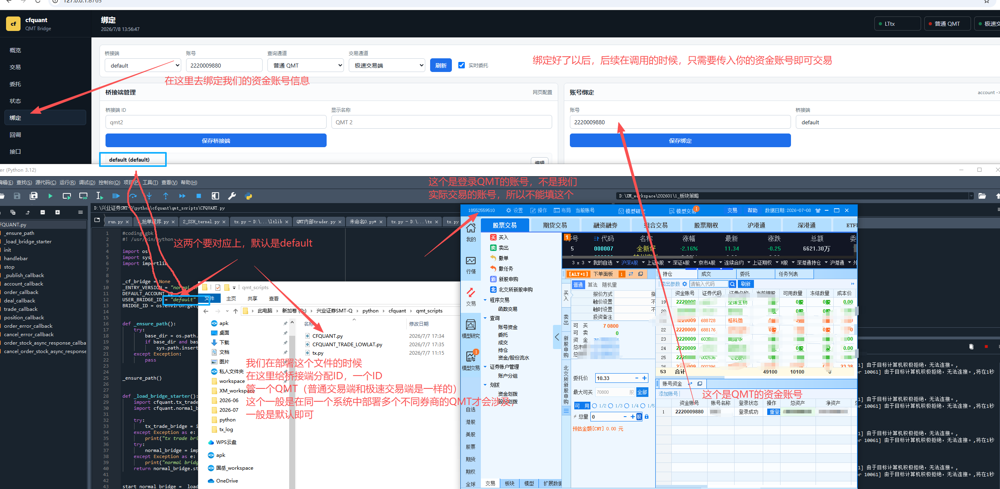

# QMT部署指南

## 一、下载python
- 打开QMT的后点模型研究或者模型交易，再点击下载python库

## 二、在模型研究里分别创建两个策略
- 点新建策略--Python策略，如图：

- 启动我们的交易端

- 确认是否成功

- tx.py放到python这个目录下，如图所示：

- 在网页端（一般是127.0.0.1:8765)对账号信息进行绑定，如图所示

## 三、后续支持
- 如果有不清楚的，可以联系我们，可远程有偿提供部署服务，100元/次，需要提前下载好向日葵或者todesk远程连接码
- QQ：445646258
- 微信号：shcfquant
- 交流群：请添加微信号后进入
