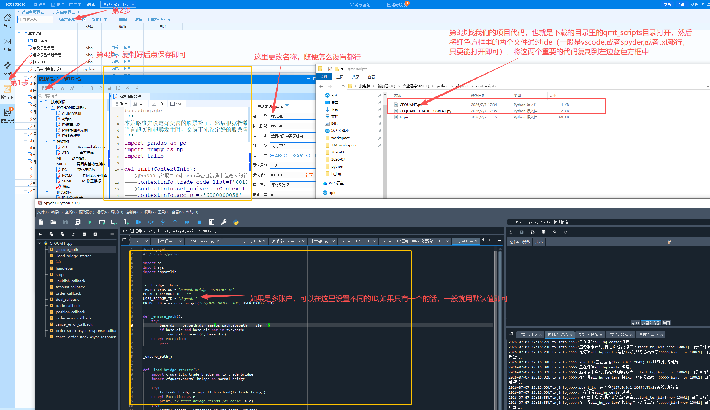
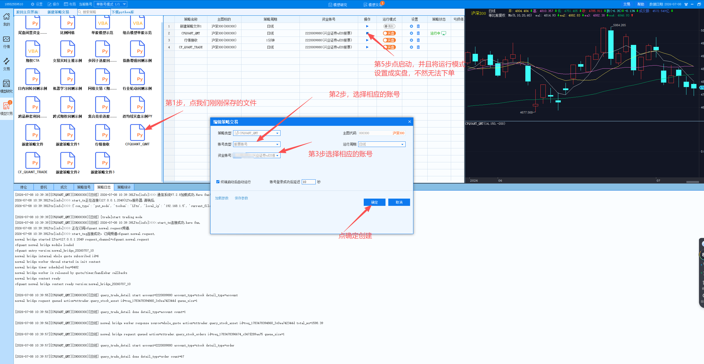
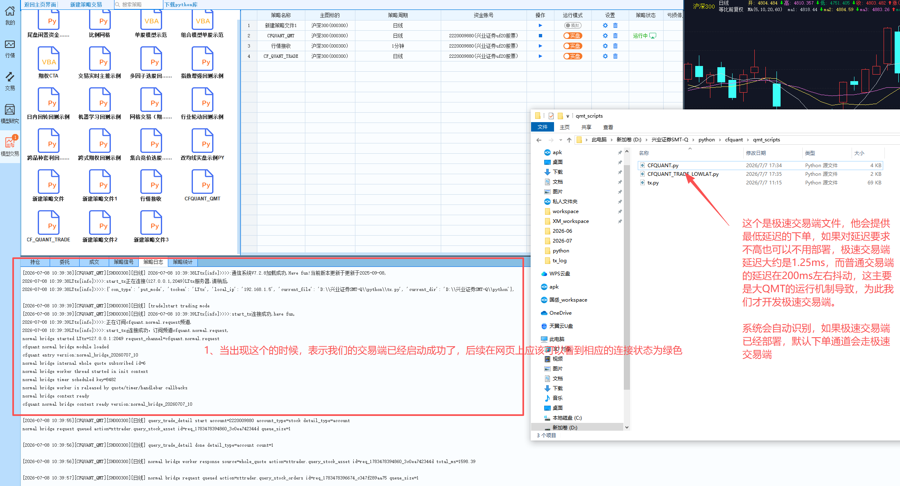
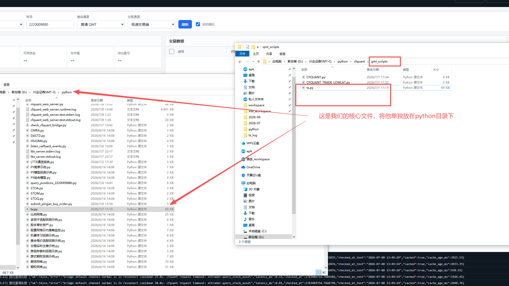
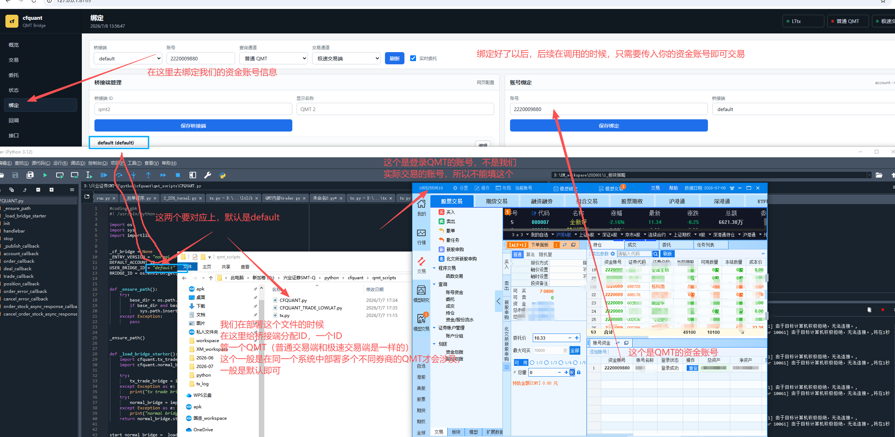

# QMT部署指南

## 重要前提：建议两端都部署
cfquant 需要本地服务端和 QMT 桥接端同时运行，完整功能才能正常使用。

- 本地服务端：在 cfquant 目录运行 `start_cfquant.bat`，启动 LTtx 和 Web 控制台。
- QMT 桥接端：把 `cfquant/`、`LTtx/`、`CFQUANT.py`、`CFQUANT_TRADE_LOWLAT.py`、`tx.py` 放到 QMT 的 Python 策略目录，并在 QMT 中加载两个桥接脚本。

只启动网页端时，可以打开控制台和配置页面，但无法真正调用 QMT 的行情、交易和账号能力；只部署 QMT 脚本但不启动本地服务端，网页端和外部 Python 也无法连接。实际使用时建议两端都部署，并在网页端完成桥接端和账号绑定。

## 一、下载python
- 打开QMT的后点模型研究或者模型交易，再点击下载python库

## 二、在模型研究里分别创建两个策略
- 点新建策略--Python策略，如图：

- 启动我们的交易端

- 确认是否成功

- tx.py放到python这个目录下，如图所示：

- 在网页端（一般是127.0.0.1:8765)对账号信息进行绑定，如图所示

完成后请同时确认：本地 Web 控制台可以访问，LTtx 状态在线，QMT 中的 `CFQUANT.py` 和 `CFQUANT_TRADE_LOWLAT.py` 都在运行，网页端绑定的资金账号指向正确桥接端。

## 三、后续支持
- 如果有不清楚的，可以联系我们，可远程有偿提供部署服务，100元/次，需要提前下载好向日葵或者todesk远程连接码
- QQ：445646258
- 微信号：shcfquant
- 交流群：请添加微信号后进入
